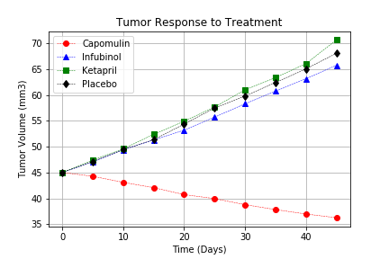
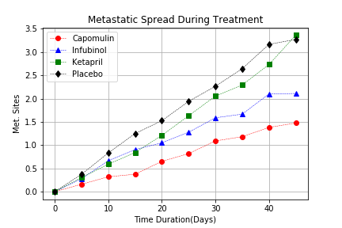
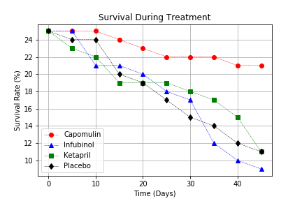
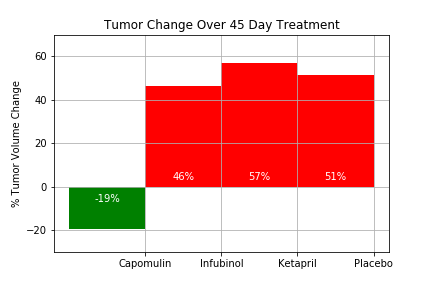

# matplotlib-challenge

# The Power of Plots

## Pymaceuticals 

Pymaceuticals Inc., a burgeoning pharmaceutical company based out of San Diego, CA. specializes in drug-based, anti-cancer pharmaceuticals. In their most recent efforts, they've since begun screening for potential treatments to squamous cell carcinoma (SCC), a commonly occurring form of skin cancer.

The objective is to analyze and compare their four treatments (Capomulin, Infubinol, Ketapril, and Placebo) given access to the complete data from their most recent animal study. In this study, 250 mice were treated through a variety of drug regimes over the course of 45 days. Their physiological responses were then monitored over the course of that time. 

The analysis was completed by creating the following plots:

* A scatter plot that shows how the tumor volume changes over time for each treatment.

* A scatter plot that shows how the number of [metastatic](https://en.wikipedia.org/wiki/Metastasis) (cancer spreading) sites changes over time for each treatment.

* A scatter plot that shows the number of mice still alive through the course of treatment (Survival Rate).

* A bar graph that compares the total % tumor volume change for each drug across the full 45 days.

Final considerations:

* The analysis was completed using the Pandas Library and the Jupyter Notebook as well as the Matplotlib library.
* The scatter plots include error bars to allow the company to account for variability between mice. 
* The bar graph indicates tumor growth as red and tumor reduction as green. It also includes a label with the percentage change for each bar.

* Three observable trends about the results of the study are as follows utilizing the visualizations generated from the study data as the basis for the observations: 

* 1. Of the four drugs being compared, Capomulin was the only drug to see a decrease in tumor volume over the 45 day period. Infubinol, Ketapril, and the placebo all saw increases in tumor over the same time period.
* 2. Capomulin saw the lowest increase in metastatic cancer sites over the 45 day treatment cycle compared to Infubinol, Ketapril, and the placebo, which saw larger increases.
* 3. Capomulin also exhibited the highest survival rate for the mice studied over the course of the 45 days. 

